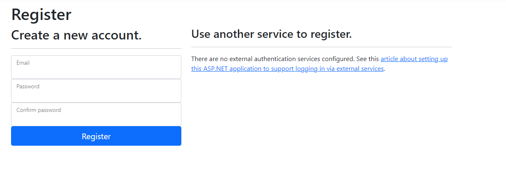

# Topic: Web Authentication & Authorisation.
## Course: Cryptography & Security
## Author: Craevscaia Valentina

# Theory
Authentication & authorization are 2 of the main security goals of IT systems
and should not be used interchangibly. Simply put, during authentication the system
verifies the identity of a user or service, and during authorization the system checks
the access rights, optionally based on a given user role.

There are multiple types of authentication based on the implementation mechanism or the
data provided by the user. Some usual ones would be the following:

1. Based on credentials (Username/Password);
2. Multi-Factor Authentication (2FA, MFA);
3. Based on digital certificates;
4. Based on biometrics;
5. Based on tokens.

Regarding authorization, the most popular mechanisms are the following:
1. Role Based Access Control (RBAC): Base on the role of a user;
2. Attribute Based Access Control (ABAC): Based on a characteristic/attribute of a user.


# Objectives:
1.Take what you have at the moment from previous laboratory works and put it in
a web service / serveral web services.
2. Your services should have implemented basic authentication and MFA
   (the authentication factors of your choice).
3. Your web app needs to simulate user authorization and the way you authorise
   user is also a choice that needs to be done by you.
4. As services that your application could provide, you could use the classical ciphers.
   Basically the user would like to get access and use the classical ciphers,
   but they need to authenticate and be authorized.

# Implementation description
Firstly, we have to create the web application, that generates the server.
This application uses MVC design pattern, that enables a clean separation of concerns.
The authentication and the authorization are mostly done with the help of the .Net
which provides the needed code.

### Authentication
Authentication is the process of determining a user's identity.
The authentication service uses registered authentication handlers 
to complete authentication-related actions.
For the register process the user has to introduce his credentials, in the image
below the email and password and password confirmation are required.



In the case the user is already logged in the email and password are required.


The snippets below are used to generate the necessary code to logIn process.
````
app.UseAuthentication();
app.UseAuthorization();

````
### Two-factor Authentication

After the LogIn is done, which is the basic authentication the MFA was added.
In our case the 2FA(two-factor authentication) was used.
This is used to increase the security of the account.


As shown in the picture, the code is needed to pursue. The code will be generated
as soon as the LogIn step was accomplished.
After passing with success the application provide the Caesar cipher and Viginere Cipher.

### Caesar and Viginere Ciphers


For example, we can take the Caesar Cipher. Here the plain text and the key should be
introduced.


The point is these options can be accessed only after the authentication and the authorization
are done.
````
[Authorize]
public IActionResult Index()
{
return View();
}

    [Authorize]
    public IActionResult CaesarView()
    {
        return View();
    }
    
    [Authorize]
    public IActionResult ViginereView()
    {
        return View();
    }
 ```` 
To pursue, we got the access to the Cipher and Viginere view.
Here are presented snippets for Viginere Cipher.

````
[Authorize]
    [HttpPost]
    public IActionResult ViginereCipher(string textToEncrypt, string key)
    {
        var model = new ViginereModel
        {
            InitialText = textToEncrypt,
            EncryptedResult = Viginere.Encrypt(textToEncrypt, key),
            DecryptedResult = Viginere.Decrypt(textToEncrypt, key),
        };
        
        return View(model);
    }
````


After the encryption is done using the key, the encrypted text is the following.


### Conclusion

In this laboratory work, we managed to create a Webservice, that has
the authentication and the authorization steps implemented. For the MFA part,
the 2FA was implemented. The user has to provide its credentials, after which to introduce
the confirmation code. As those steps are accomplished the user can access the new mode
where he can use the classical ciphers to encrypt the message.

